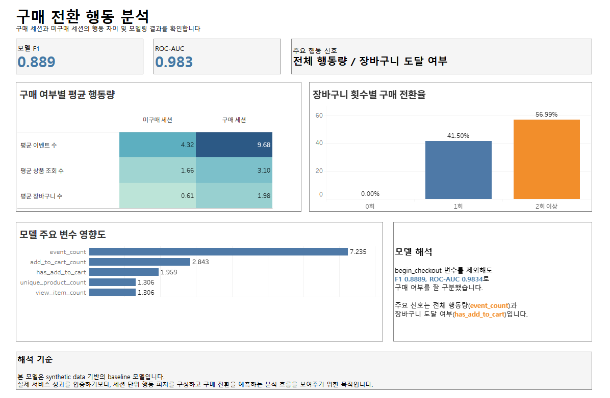
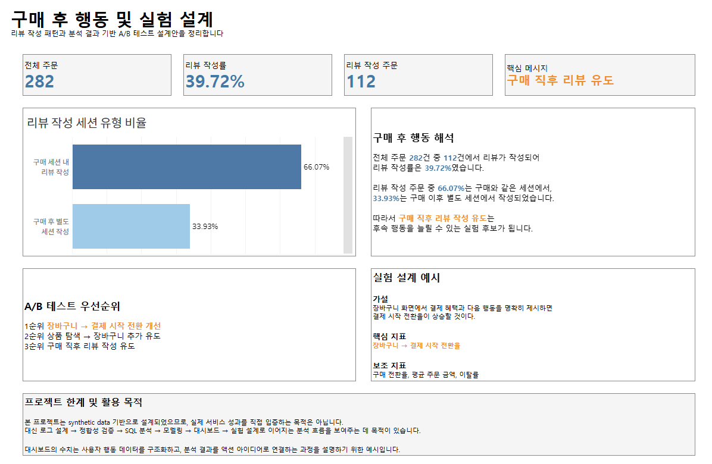

# Log-Based E-commerce User Journey Analysis

Synthetic e-commerce event log data를 기반으로 사용자의 구매 여정을 분석한 end-to-end 데이터 분석 프로젝트입니다. 이벤트 로그 설계에서 시작해 관계형 테이블 설계, MySQL 적재, 데이터 정합성 검증, SQL 기반 퍼널 분석, Python 기반 세션 단위 분석과 구매 전환 예측 모델링, Tableau 대시보드, A/B 테스트 설계까지 하나의 분석 흐름으로 구성했습니다.

## 1. 프로젝트 개요

이 프로젝트는 실제 서비스 로그와 유사한 synthetic data를 직접 설계하고 생성한 뒤, e-commerce 사용자 행동을 세션 단위로 분석하는 것을 목표로 합니다.

분석 흐름은 다음과 같습니다.

1. 이벤트 로그 설계
2. 엔티티 및 테이블 설계
3. MySQL 기반 데이터 적재
4. 데이터 품질 및 정합성 검증
5. SQL 기반 퍼널 분석
6. Python 기반 세션 단위 분석
7. 구매 전환 예측 모델링
8. Tableau 대시보드 시각화
9. 분석 결과 기반 A/B 테스트 설계

## 2. 분석 목적

이 프로젝트의 목적은 단순히 예측 모델을 만드는 것이 아니라, 로그 기반 분석 프로젝트의 전체 과정을 데이터 분석가 관점에서 재현하는 것입니다.

- 사용자의 구매 여정을 이벤트 로그 단위로 설계합니다.
- 관계형 데이터베이스에서 분석 가능한 테이블 구조를 설계합니다.
- MySQL에 synthetic data를 적재하고 데이터 품질을 검증합니다.
- SQL로 퍼널, 전환, 이탈, 구매 후 리뷰 행동을 분석합니다.
- Python으로 세션 단위 feature를 구성하고 구매 전환 예측 모델을 학습합니다.
- Tableau로 핵심 지표와 분석 결과를 대시보드로 정리합니다.
- 분석 결과를 바탕으로 검증 가능한 A/B 테스트 설계안을 도출합니다.

## 3. 분석 질문

- 사용자는 구매 퍼널의 어느 단계에서 가장 많이 이탈하는가?
- 구매 세션과 비구매 세션의 행동 패턴은 어떻게 다른가?
- 구매 전환을 설명하는 주요 세션 행동 변수는 무엇인가?
- 장바구니 추가 횟수는 구매 전환율과 어떤 관계가 있는가?
- 구매 후 리뷰 작성은 구매 세션 내에서 주로 발생하는가, 별도 세션에서 발생하는가?
- 분석 결과를 바탕으로 어떤 A/B 테스트를 우선 설계할 수 있는가?

## 4. 데이터 구조

이 프로젝트의 데이터는 GA4-style event-based analytics 개념을 참고하되, 포트폴리오 분석 목적에 맞게 직접 설계한 synthetic data입니다.

주요 이벤트는 다음과 같습니다.

- `session_start`
- `search`
- `view_item_list`
- `view_item`
- `add_to_cart`
- `begin_checkout`
- `purchase`
- `review_write`

주요 테이블은 다음과 같습니다.

| Table | Description | Row Count |
|---|---|---:|
| `users` | 사용자 정보 | 300 |
| `sessions` | 사용자 방문 세션 | 1000 |
| `event_logs` | 세션 내 이벤트 로그 | 5832 |
| `orders` | 주문 정보 | 282 |
| `order_items` | 주문 상품 상세 | 558 |
| `reviews` | 구매 후 리뷰 | 112 |
| `categories` | 상품 카테고리 | 4 |
| `products` | 상품 정보 | 30 |

프로젝트 구조는 다음과 같습니다.

```text
Log-Based-E-commerce-User-Journey-Analysis/
├── assets/
│   └── dashboard/
├── data/
├── docs/
├── notebooks/
├── outputs/
│   └── figures/
├── scripts/
├── sql/
├── tableau/
└── README.md
```

## 5. SQL 기반 데이터 설계 및 정합성 검증

MySQL 기반으로 사용자, 세션, 이벤트 로그, 주문, 주문 상품, 리뷰 테이블을 분리해 설계했습니다. 이벤트 로그는 사용자 행동의 원천 데이터 역할을 하며, 주문 및 리뷰 테이블과 연결해 구매 전환과 구매 후 행동을 분석할 수 있도록 구성했습니다.

주요 SQL 파일은 다음과 같습니다.

- [`sql/schema.sql`](sql/schema.sql): MySQL 테이블 생성
- [`sql/seed_data.sql`](sql/seed_data.sql): 소규모 검증용 샘플 데이터
- [`sql/seed_synthetic_data.sql`](sql/seed_synthetic_data.sql): 분석용 synthetic data 적재
- [`sql/basic_validation.sql`](sql/basic_validation.sql): 기본 실행 검증
- [`sql/quality_checks.sql`](sql/quality_checks.sql): 데이터 품질 및 정합성 검증
- [`sql/funnel_analysis.sql`](sql/funnel_analysis.sql): 퍼널 및 이탈 분석
- [`sql/conversion_analysis.sql`](sql/conversion_analysis.sql): 구매 전환 행동 분석
- [`sql/post_purchase_analysis.sql`](sql/post_purchase_analysis.sql): 구매 후 리뷰 행동 분석
- [`sql/session_level_features.sql`](sql/session_level_features.sql): 세션 단위 모델링 feature dataset 생성

정합성 검증 단계에서는 PK/FK 관계, 세션과 이벤트의 연결, 주문과 주문 상품의 연결, 구매 이벤트와 주문 데이터 간 관계를 확인했습니다. 이 과정을 통해 이후 SQL 분석과 Python 모델링에서 사용할 세션 단위 데이터의 기준을 명확히 했습니다.

## 6. 세션 단위 사용자 여정 분석

SQL 분석 결과, 전체 1,000개 세션 중 282개 세션이 구매까지 도달했습니다. 전체 구매 전환율은 28.2%입니다.

### 퍼널 분석

| Funnel Stage | Reached Sessions |
|---|---:|
| `session_start` | 1000 |
| `view_item` | 867 |
| `add_to_cart` | 578 |
| `begin_checkout` | 366 |
| `purchase` | 282 |

주요 이탈 지점은 `add_to_cart` -> `begin_checkout` 구간입니다. 이 구간에서 이탈한 세션 수는 212개이며, `add_to_cart` -> `begin_checkout` 전환율은 63.32%입니다.

### 구매 전환 행동 분석

| Metric | Purchase Sessions | Non-purchase Sessions |
|---|---:|---:|
| 평균 이벤트 수 | 9.68 | 4.32 |
| 평균 상품 조회 수 | 3.10 | 1.66 |
| 평균 장바구니 추가 수 | 1.98 | 0.61 |

구매 세션은 비구매 세션보다 평균 이벤트 수, 상품 조회 수, 장바구니 추가 수가 모두 높게 나타났습니다. 이는 구매 전환이 단일 이벤트보다 세션 내 누적 행동 강도와 관련이 있음을 보여줍니다.

### 장바구니 횟수별 구매 전환율

| Add-to-cart Count | Purchase Conversion Rate |
|---|---:|
| 장바구니 0회 | 0.00% |
| 장바구니 1회 | 41.50% |
| 장바구니 2회 이상 | 56.99% |

장바구니 추가 행동은 구매 전환과 밀접하게 연결되어 있으며, 특히 장바구니 2회 이상 세션의 구매 전환율이 가장 높게 나타났습니다.

### 구매 후 리뷰 행동

| Metric | Value |
|---|---:|
| 전체 주문 수 | 282 |
| 리뷰 작성 주문 수 | 112 |
| 리뷰 작성률 | 39.72% |
| 구매 세션 내 리뷰 작성 비율 | 66.07% |
| 구매 후 별도 세션 리뷰 작성 비율 | 33.93% |

리뷰 작성 주문 중 66.07%는 구매와 같은 세션에서 리뷰가 작성되었습니다. 이 결과는 구매 완료 직후 리뷰 작성 CTA를 노출하는 실험 설계의 근거로 사용할 수 있습니다.

## 7. 구매 전환 예측 모델링

Python에서는 SQL로 생성한 [`outputs/session_level_features.csv`](outputs/session_level_features.csv)를 기반으로 세션 단위 구매 전환 예측 모델을 학습했습니다. 모델 학습 코드는 [`scripts/model_logistic_regression.py`](scripts/model_logistic_regression.py)에 정리되어 있으며, 분석 노트북은 [`notebooks/01_user_journey_conversion_analysis.ipynb`](notebooks/01_user_journey_conversion_analysis.ipynb)입니다.

모델링은 구매 직전 행동인 `begin_checkout` 변수를 제외한 기준으로 해석했습니다. 이는 결제 시작 여부를 직접 사용하는 대신, 그 이전의 탐색 및 장바구니 행동만으로 구매 전환 가능성을 어느 정도 구분할 수 있는지 확인하기 위한 설정입니다.

| Model | Feature Setting | F1 Score | ROC-AUC |
|---|---|---:|---:|
| Logistic Regression | `begin_checkout` 변수 제외 | 0.889 | 0.983 |

주요 변수는 다음과 같습니다.

- `event_count`
- `add_to_cart_count`
- `has_add_to_cart`
- `unique_product_count`
- `view_item_count`

모델 결과는 synthetic data 기반의 실험 결과이므로 실제 서비스의 예측 성능으로 일반화할 수는 없습니다. 다만 세션 단위 feature 설계, target leakage 점검, 모델 학습과 평가 지표 산출까지 이어지는 분석 파이프라인을 검증하는 데 목적이 있습니다.

## 8. Tableau 대시보드

분석 결과는 Tableau Public 대시보드로 정리했습니다.

[Tableau Public Dashboard](https://public.tableau.com/app/profile/.58327183/viz/E-commerceUserJourneyAnalysisDashboard/03_)

### 1. 구매 퍼널 분석


### 2. 구매 전환 행동 분석



### 3. 구매 후 행동 및 실험 설계



## 9. A/B 테스트 설계안

SQL, Python, Tableau 분석 결과를 바탕으로 다음 세 가지 실험안을 도출했습니다.

### 1순위: 장바구니 -> 결제 시작 전환 개선

- 관찰 결과: 가장 큰 이탈 지점은 `add_to_cart` -> `begin_checkout` 구간입니다.
- 가설: 장바구니 화면에서 결제 혜택, 배송 정보, 다음 행동 버튼을 명확히 제시하면 결제 시작 전환율이 상승할 것입니다.
- 핵심 지표: `add_to_cart` -> `begin_checkout` 전환율
- 보조 지표: 구매 전환율, 평균 주문 금액, 이탈률

### 2순위: 상품 탐색 -> 장바구니 추가 유도

- 관찰 결과: 구매 세션은 비구매 세션보다 상품 조회 수와 장바구니 추가 수가 높습니다.
- 가설: 상품 상세 페이지에서 추천 상품, 리뷰, 할인 정보를 강화하면 장바구니 추가율이 상승할 것입니다.
- 핵심 지표: `view_item` -> `add_to_cart` 전환율
- 보조 지표: 구매 전환율, 상품 조회 수, 세션당 이벤트 수

### 3순위: 구매 직후 리뷰 작성 유도

- 관찰 결과: 리뷰 작성 주문 중 66.07%는 구매와 같은 세션에서 리뷰가 작성됩니다.
- 가설: 구매 완료 직후 리뷰 작성 CTA를 제공하면 리뷰 작성률이 상승할 것입니다.
- 핵심 지표: 리뷰 작성률
- 보조 지표: 리뷰 작성 세션 비율, 재방문율

## 10. 프로젝트 한계 및 개선 방향

이 프로젝트는 synthetic data 기반 분석입니다. 실제 서비스 데이터를 사용한 것이 아니므로, 퍼널 전환율, 이탈 지점, 모델 성능, 리뷰 작성률 등의 결과를 실제 비즈니스 성과로 일반화할 수는 없습니다.

대신 이 프로젝트의 목적은 로그 설계, 엔티티 및 테이블 설계, 데이터 적재, 정합성 검증, SQL 분석, Python 모델링, Tableau 대시보드, 실험 설계로 이어지는 전체 분석 프로세스를 보여주는 것입니다.

실제 데이터가 주어진다면 다음 방향으로 확장할 수 있습니다.

- 유입 채널별 전환율 분석
- 마케팅 캠페인별 퍼널 성과 비교
- 상품 가격 및 할인 정보 기반 구매 전환 분석
- 사용자 재방문 주기 분석
- 코호트 기반 리텐션 분석
- 신규 사용자와 재방문 사용자 비교
- A/B 테스트 실제 실험군/대조군 성과 검정

## 실행 방법

MySQL Workbench 기준 실행 순서는 다음과 같습니다.

```sql
DROP DATABASE IF EXISTS ecommerce_journey;
CREATE DATABASE ecommerce_journey;
USE ecommerce_journey;
```

SQL 파일 실행 순서:

1. `sql/schema.sql`
2. `sql/seed_synthetic_data.sql`
3. `sql/basic_validation.sql`
4. `sql/quality_checks.sql`
5. `sql/funnel_analysis.sql`
6. `sql/conversion_analysis.sql`
7. `sql/post_purchase_analysis.sql`
8. `sql/session_level_features.sql`

Python 모델링 실행:

```bash
python scripts/model_logistic_regression.py
```

## 관련 문서

- [`docs/project_plan.md`](docs/project_plan.md)
- [`docs/event_definition.md`](docs/event_definition.md)
- [`docs/entity_definition.md`](docs/entity_definition.md)
- [`docs/table_specification.md`](docs/table_specification.md)
- [`docs/data_quality_rules.md`](docs/data_quality_rules.md)
- [`docs/mysql_execution_validation.md`](docs/mysql_execution_validation.md)
- [`docs/analysis_results.md`](docs/analysis_results.md)
- [`docs/ab_test_design.md`](docs/ab_test_design.md)
- [`docs/tableau_dashboard_design.md`](docs/tableau_dashboard_design.md)
- [`docs/portfolio_summary.md`](docs/portfolio_summary.md)
- [`docs/interview_project_script.md`](docs/interview_project_script.md)
- [`docs/decision_log.md`](docs/decision_log.md)
