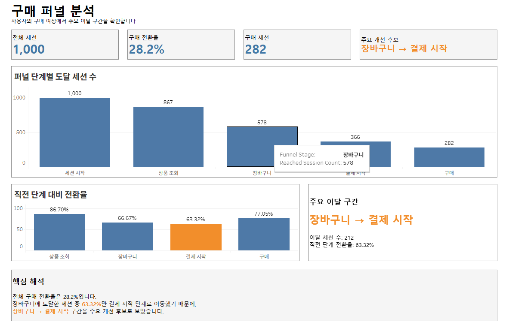

# E-commerce User Journey Analysis Summary

## 1. Project Overview

- 프로젝트명: Log-Based E-commerce User Journey Analysis
- 기간: 2026.05.30 ~ 2026.06
- 사용 기술: MySQL, SQL, Python, pandas, scikit-learn, Tableau
- Tableau Public: [Tableau Public Dashboard](https://public.tableau.com/app/profile/.58327183/viz/E-commerceUserJourneyAnalysisDashboard/03_)
- GitHub Repository: [GitHub Repository](https://github.com/wxlovolxw/Log-Based-E-commerce-User-Journey-Analysis)

## 2. Why This Project

이 프로젝트는 이커머스 사용자의 구매 여정을 이벤트 로그 기반으로 설계하고 분석하기 위해 진행했습니다. 사용자가 상품을 탐색하고, 장바구니에 담고, 결제를 시작해 구매까지 도달하는 과정에서 어느 지점에서 이탈이 발생하는지 확인했습니다. SQL, Python, Tableau를 사용해 퍼널 분석, 세션 단위 행동 분석, 구매 전환 모델링을 하나의 흐름으로 연결했습니다. 단순히 모델 성능을 확인하는 데서 끝내지 않고, 분석 결과를 대시보드와 A/B 테스트 아이디어로 정리해 실제 개선 액션으로 이어질 수 있도록 구성했습니다.

## 3. Analysis Flow

`Log Design → MySQL Validation → SQL Funnel Analysis → Python Modeling → Tableau Dashboard → A/B Test Ideas`

- Log Design: `session_start`, `view_item`, `add_to_cart`, `begin_checkout`, `purchase`, `review_write` 등 주요 이벤트를 정의하고 사용자 여정을 로그 구조로 설계했습니다.
- MySQL Validation: 사용자, 세션, 상품, 주문, 리뷰, 이벤트 로그 테이블을 생성하고 데이터 관계와 정합성을 검증했습니다.
- SQL Funnel Analysis: 구매 퍼널 단계별 도달 세션 수와 이탈 지점을 SQL로 산출했습니다.
- Python Modeling: `session_level_features.csv`를 기반으로 세션 단위 행동 차이를 분석하고 Logistic Regression 모델을 학습했습니다.
- Tableau Dashboard: 퍼널, 전환 행동, 구매 후 리뷰 행동을 Tableau 대시보드로 시각화했습니다.
- A/B Test Ideas: 주요 이탈 지점과 행동 차이를 바탕으로 실험 가설과 핵심 지표를 정리했습니다.

## 4. Key Results

| Metric | Result |
|---|---:|
| 전체 세션 수 | 1000 |
| 구매 세션 수 | 282 |
| 구매 전환율 | 28.2% |
| `add_to_cart` → `begin_checkout` 전환율 | 63.32% |
| 구매 세션 평균 이벤트 수 | 9.68 |
| 비구매 세션 평균 이벤트 수 | 4.32 |
| 장바구니 1회 구매 전환율 | 41.50% |
| 장바구니 2회 이상 구매 전환율 | 56.99% |
| Logistic Regression F1 Score | 0.889 |
| ROC-AUC | 0.983 |
| 리뷰 작성률 | 39.72% |

퍼널 흐름은 `session_start 1000 → view_item 867 → add_to_cart 578 → begin_checkout 366 → purchase 282`로 나타났습니다. 주요 이탈 지점은 `add_to_cart` → `begin_checkout` 구간이었으며, 장바구니 이후 결제 시작으로 넘어가는 과정이 전환 개선의 핵심 지점으로 해석됩니다.

## 5. Dashboard

[Tableau Public Dashboard](https://public.tableau.com/app/profile/.58327183/viz/E-commerceUserJourneyAnalysisDashboard/03_)

대시보드는 세 가지 목적을 중심으로 구성했습니다.

1. 구매 퍼널 분석: 단계별 도달 세션 수와 주요 이탈 지점을 확인합니다.
2. 구매 전환 행동 분석: 구매 세션과 비구매 세션의 행동 차이를 비교합니다.
3. 구매 후 행동 및 실험 설계: 리뷰 작성 행동과 후속 실험 아이디어를 연결합니다.

## 6. A/B Test Ideas

1. 장바구니 → 결제 시작 전환 개선
   - 관찰 결과: 가장 큰 이탈 지점은 `add_to_cart` → `begin_checkout` 구간입니다.
   - 가설: 장바구니 화면에서 결제 혜택, 배송 정보, CTA를 명확히 제시하면 결제 시작 전환율이 상승할 것입니다.
   - 핵심 지표: `add_to_cart` → `begin_checkout` 전환율

2. 상품 탐색 → 장바구니 추가 유도
   - 관찰 결과: 구매 세션은 비구매 세션보다 상품 조회 수와 장바구니 추가 수가 높았습니다.
   - 가설: 상품 상세 페이지에서 추천 상품, 리뷰, 할인 정보를 강화하면 장바구니 추가율이 상승할 것입니다.
   - 핵심 지표: `view_item` → `add_to_cart` 전환율

3. 구매 직후 리뷰 작성 유도
   - 관찰 결과: 리뷰 작성 주문 중 66.07%가 구매와 같은 세션에서 작성되었습니다.
   - 가설: 구매 완료 직후 리뷰 작성 CTA를 제공하면 리뷰 작성률이 상승할 것입니다.
   - 핵심 지표: 리뷰 작성률

## 7. Limitations

이 프로젝트는 synthetic data 기반이므로 분석 결과를 실제 서비스 성과로 일반화할 수는 없습니다. 대신 로그 설계, 정합성 검증, 분석, 모델링, 시각화, 실험 설계로 이어지는 end-to-end 분석 프로세스를 보여주는 데 목적이 있습니다.

## 8. Skills Demonstrated

- Event log design
- SQL data validation
- Funnel analysis
- Session-level feature engineering
- Logistic Regression modeling
- Tableau dashboarding
- A/B test planning
